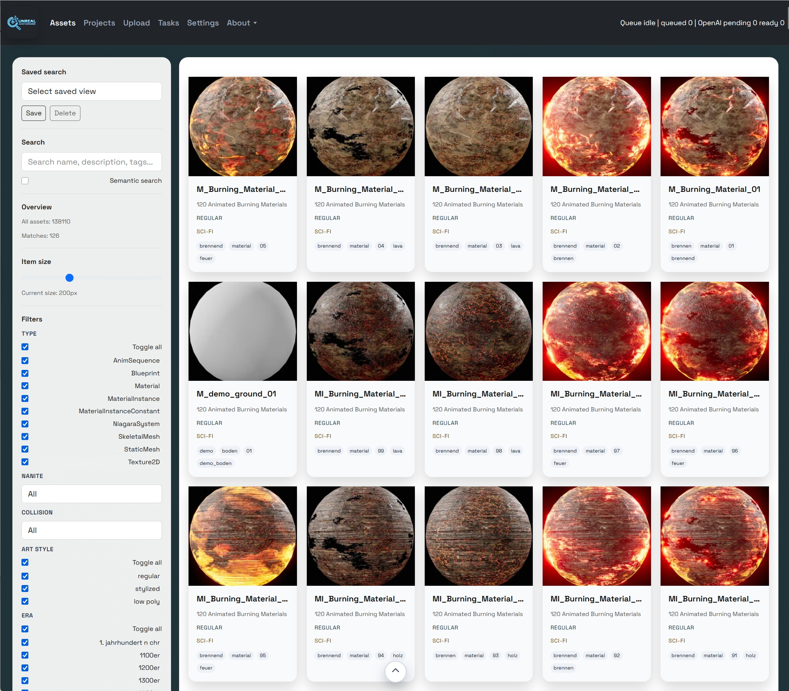
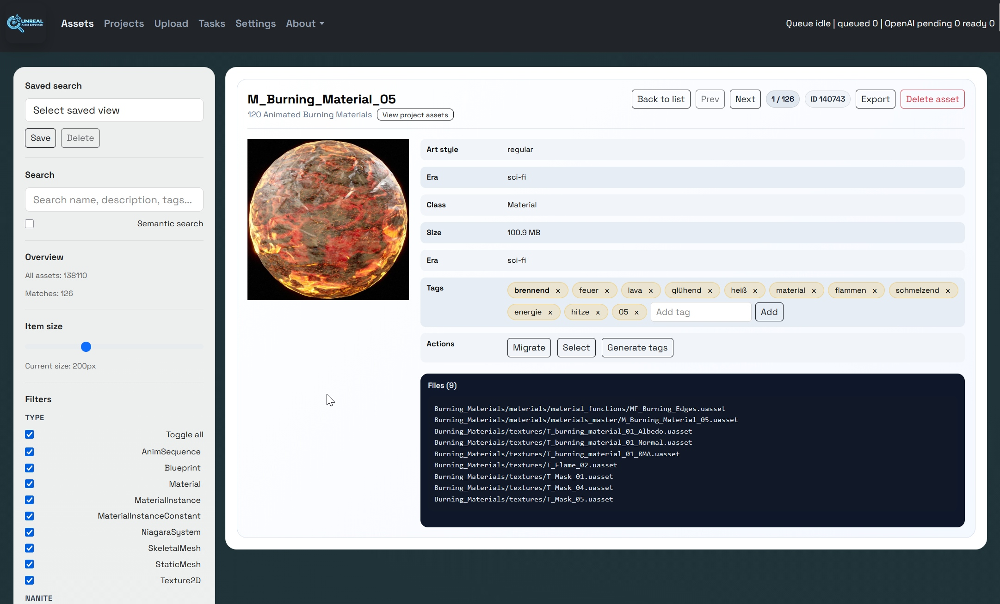
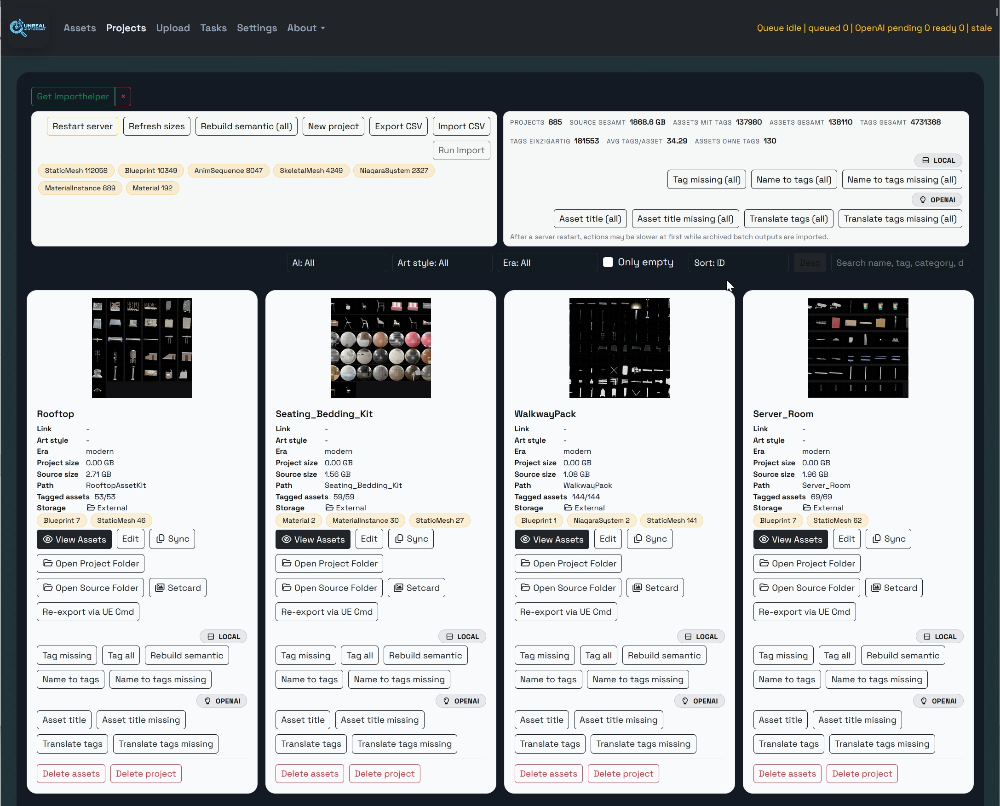
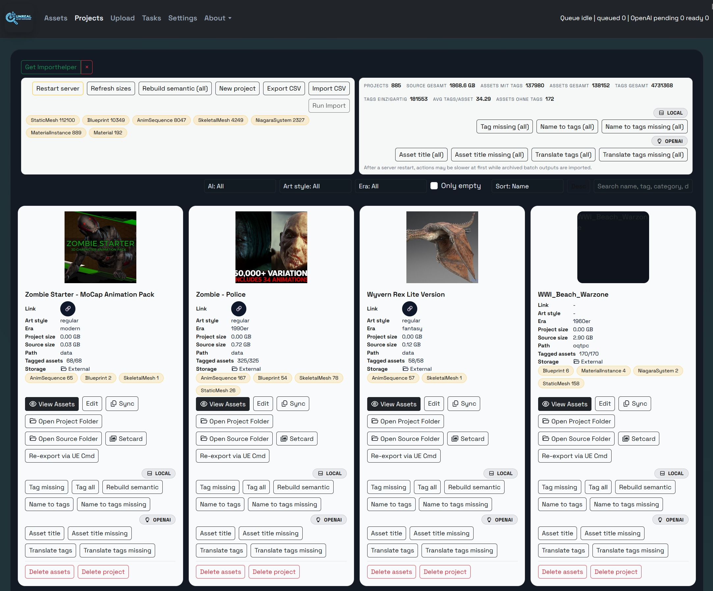
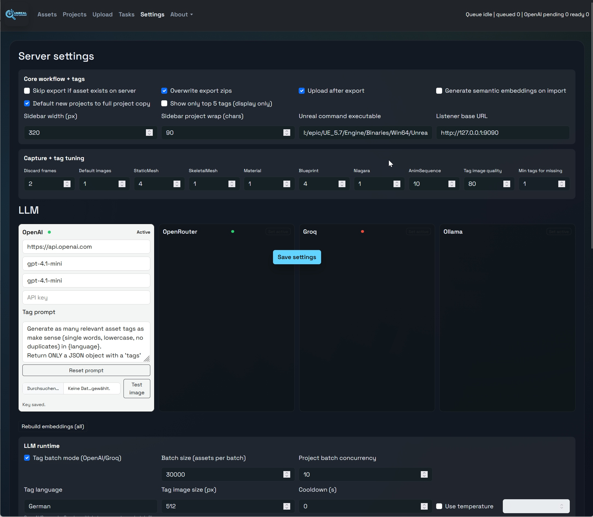

# AssetExplorerForUnreal

UnrealAssetExplorer is the management tool for Unreal Engine asset packs.
It combines a FastAPI backend with a React frontend and adds workflows for:

- project and asset indexing
- preview images/screenshots
- metadata and tag management
- LLM/OpenAI-assisted tag generation and translation
- semantic search (embeddings)
- import/export/sync flows for UE asset packs

## Unreal Integration

For Unreal-side interaction you need:

- https://github.com/UbahnWorkerGames/UnrealAssetExplorerBridge

The bridge is currently shipped for UE 5.7.

Important:

- the exporter needs UnrealAssetExplorer running during export
- ports are configurable in both places:
  - Unreal plugin settings
  - UnrealAssetExplorer settings

## Tech Stack

- Backend: Python, FastAPI, SQLite
- Frontend: React + Vite (built as static files)
- Data storage: `data/` directory (database, media, batch outputs)

## Repository Layout

- `backend/` - API server and processing logic
- `frontend/` - React UI source
- `data/` - runtime data (created/used by backend)
- `build-ui.bat` - one-time frontend build (Windows)
- `build-ui.sh` - one-time frontend build (Linux/macOS)
- `start-dev.bat` - dev mode (Vite + backend reload)
- `start-prod.bat` - production runtime on Windows (Python-only)
- `start-prod.sh` - production runtime on Linux (Python-only)

## Requirements

### Development

- Python 3.10+
- Node.js + npm

### Production Runtime

- Python 3.10+
- Prebuilt frontend `frontend/dist`

Node is only required to build the frontend once.
The frontend is pre-generated in this repo, so you can start directly with the Python runtime scripts.

## Quick Start

### 1) Production runtime (Windows, direct start)

```bat
start-prod.bat
```

You can start directly with this.
No frontend build step is required for normal use.

### 2) Production runtime (Linux, direct start)

```bash
chmod +x start-prod.sh
./start-prod.sh
```

### 3) Dev mode (Windows)

```bat
start-dev.bat
```

This starts:

- Vite dev server for frontend
- FastAPI backend with auto-reload on `127.0.0.1:8008`

### 4) Optional: rebuild frontend bundle (Windows)

```bat
build-ui.bat
```

Use this only if you changed frontend source code and want a new `frontend/dist`.

### 5) Optional: rebuild frontend bundle (Linux/macOS)

```bash
chmod +x build-ui.sh
./build-ui.sh
```

## UI Delivery Modes

- Dev: frontend served by Vite
- Prod: frontend served by backend from `frontend/dist`

If UI assets fail to load after a new build, rebuild frontend and hard-refresh browser cache.

## UI Overview

Screenshots (from `Images/`):







## Project Actions (What Each Button Does)

Global row:

- `View Assets`: open the asset list filtered to the selected project.
- `Edit`: edit project name, source path/folder, and metadata.
- `Sync`: reimport/sync files from the configured source into local project storage.
- `Open Project Folder`: open local project folder on disk.
- `Open Source Folder`: open configured source folder on disk.
- `Setcard`: generate or refresh `setcard.png` from project preview images.
- `Re-export via UE Cmd`: run UnrealEditor-Cmd export flow, then reimport/sync.

Local row:

- `Tag missing`: queue AI tagging for assets not tagged yet (`asset_tags.tags_done_at` missing).
- `Tag all`: queue full retag and replace existing tags.
- `Rebuild semantic`: rebuild embeddings for project assets.
- `Name to tags`: create tags from asset names (local, no LLM translation).
- `Name to tags missing`: run name-to-tags only for assets not processed by this action yet (`name_tags_done_at` missing).

LLM row (provider-dependent):

- `Asset title`: LLM name-to-tag generation for all assets in the project.
- `Asset title missing`: same, but only where `name_translate_tags_done_at` is missing.
- `Translate tags`: LLM translation of existing tags for all assets in the project.
- `Translate tags missing`: same, but only where `translate_tags_done_at` is missing.

Danger row:

- `Delete assets`: delete project assets from DB (files on disk stay untouched).
- `Delete project`: delete project and its DB asset records (files on disk stay untouched).

## Notes

- SQLite is used by default; long-running write tasks can temporarily lock DB operations.
- Startup may process archived batch outputs before all write endpoints are available.
- API health endpoint: `GET /health`

## License

See `LICENSE`.

## Support

- Patreon: https://patreon.com/UbahnWorkerGames

## Extras

- You may also buy the Epic import script.
