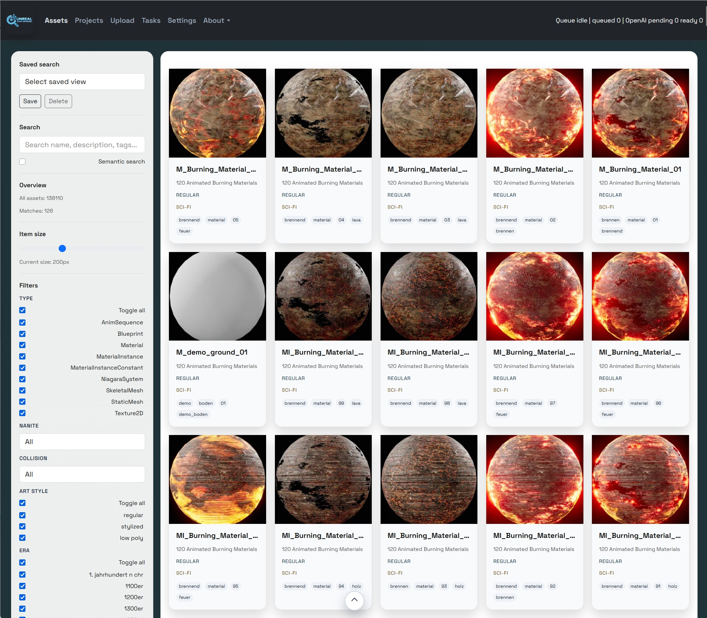
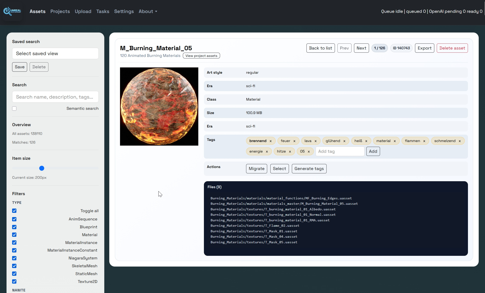
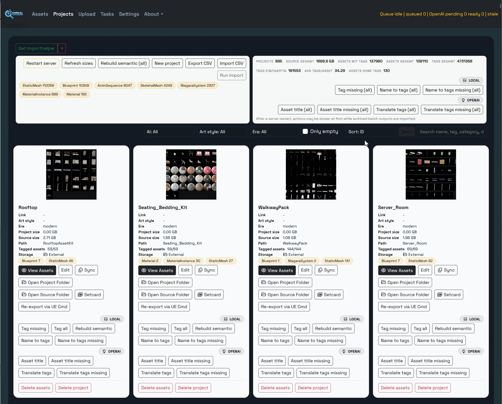
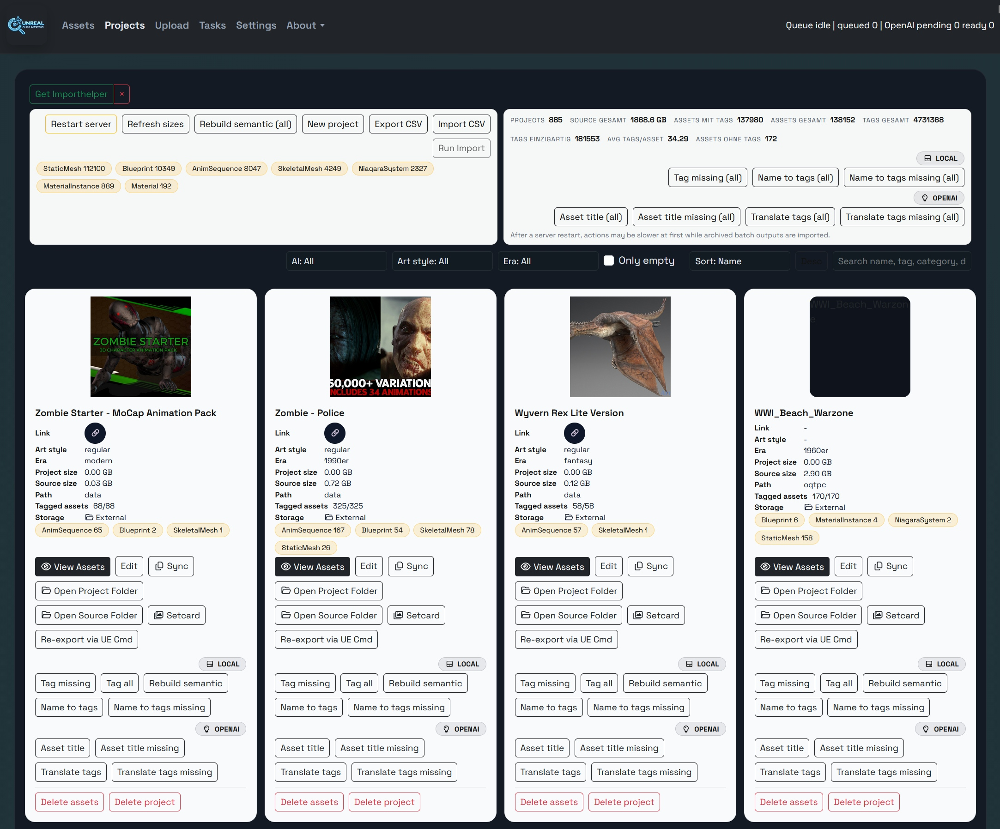
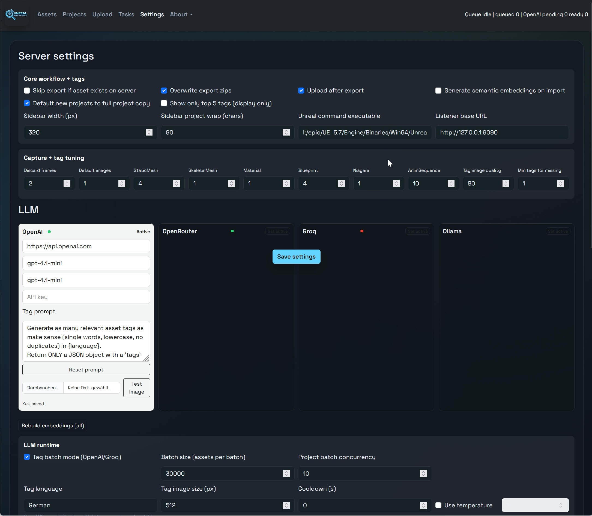
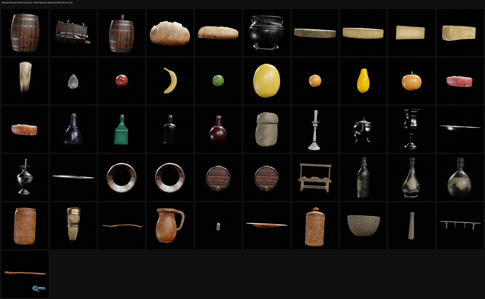
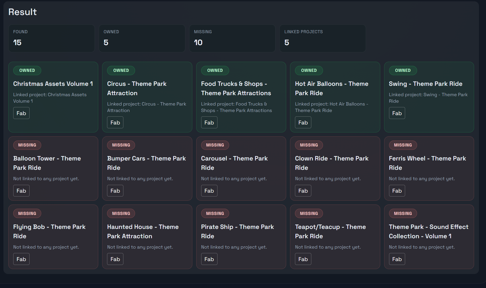

# AssetExplorerForUnreal

UnrealAssetExplorer is the management tool for Unreal Engine asset packs.
It combines a FastAPI backend with a React frontend and adds workflows for:

- project and asset indexing
- preview images/screenshots
- metadata and tag management
- LLM/OpenAI-assisted tag generation and translation
- import/export/sync flows for UE asset packs
- HumbleBundle/Fab listing checks against projects already in the database

## Unreal Integration

For Unreal-side interaction you need:

- https://github.com/UbahnWorkerGames/UnrealAssetExplorerBridge

Use the bridge release that matches your Unreal version.

Important:

- the exporter needs UnrealAssetExplorer running during export
- ports are configurable in both places:
  - Unreal plugin settings
  - UnrealAssetExplorer settings
- the frontend dev server proxies API and SSE routes to the backend, so `http://127.0.0.1:5173/events` works in dev

Project model:

- Projects now have an explicit source mode in the UI:
  - `External` keeps the source tied to the original pack path.
  - `Internal` prefers the local project folder for open/export decisions.
- `full_project_copy` controls whether the whole project is copied or only the selected source folder.
- Prefer creating/syncing projects via Unreal export/import flow (AEB bridge or Epic/Fab import script), not by manual database edits.
- Typical export calls are:
  - `aeb /Game/`
  - `aeb /Game/byHans1/MyPack/SM_Crate.SM_Crate`
- This keeps `project_root` / `source_folder` mapping consistent and avoids duplicate or wrong project roots.

Delivery standard:

- Python is the only runtime prerequisite for users who clone the repo.
- Do not require npm for cloned users; only use it when rebuilding frontend source changes.
- When frontend changes require a rebuild, include the regenerated `frontend/dist` files in git so the repo stays directly runnable.

Project path blacklist:

- Setting: `project_path_blacklist` in UnrealAssetExplorer settings.
- Use it for source roots you manually confirmed as duplicates and want to skip on later imports.
- One path per line or CSV entry is fine.
- The importer skips matching project roots before creating a new project entry.

Tag import startup deferral:

- Large tag CSV imports can be deferred to startup instead of running immediately.
- The toggle lives in Settings as `Defer large tag imports to startup`.
- Imports over 1000 data rows are queued into `startup_jobs` and processed on the next backend restart.
- The UI shows a clear deferred-state message instead of a generic task toast.

## Tech Stack

- Backend: Python, FastAPI, SQLite
- Frontend: React + Vite (built as static files)
- Data storage: `data/` directory (database, media, batch outputs)

## Repository Layout

- `backend/` - API server and processing logic
- `frontend/` - React UI source
- `data/` - runtime data (created/used by backend)
- `build-ui.bat` - one-time frontend build (Windows)
- `build-ui.sh` - one-time frontend build (Linux/macOS)
- `start-dev.bat` - dev mode (Vite + backend reload)
- `start-prod.bat` - production runtime on Windows (Python-only)
- `start-prod.sh` - production runtime on Linux (Python-only)

## Requirements

### Development

- Python 3.10+
- Node.js + npm only if you change frontend source and rebuild `frontend/dist`

### Production Runtime

- Python 3.10+
- Prebuilt frontend `frontend/dist`

Node.js/npm are not required for normal use after cloning this repo.
The frontend is pre-generated in this repo, and when frontend code changes we rebuild `frontend/dist` and commit the generated files.

## Quick Start

### 1) Production runtime (Windows, direct start)

```bat
start-prod.bat
```

You can start directly with this.
No frontend build step is required for normal use.

### 2) Production runtime (Linux, direct start)

```bash
chmod +x start-prod.sh
./start-prod.sh
```

### 3) Dev mode (Windows)

```bat
start-dev.bat
```

This starts:

- Vite dev server for frontend
- FastAPI backend with auto-reload on `127.0.0.1:7985`

### 4) Optional: rebuild frontend bundle (Windows)

```bat
build-ui.bat
```

Use this only if you changed frontend source code and want a new `frontend/dist`.

### 5) Optional: rebuild frontend bundle (Linux/macOS)

```bash
chmod +x build-ui.sh
./build-ui.sh
```

## UI Delivery Modes

- Dev: frontend served by Vite
- Prod: frontend served by backend from `frontend/dist`

If UI assets fail to load after a new build, rebuild frontend and hard-refresh browser cache.

## UI Overview

Screenshots (from `Images/`):








UI Extras:

- `HumbleBundle Check`: paste a Fab JSON object or raw page HTML and compare the listings against your existing projects.
- Owned items are shown with matching projects; missing items stay visible for manual follow-up.
- The Fab listing is opened from a compact button instead of a long URL.



Short guide:

1. Paste the raw Fab page HTML or the JSON object into `HumbleBundle Check`.
2. Click `Analyze`.
3. Read the summary counts for `Found`, `Owned`, `Missing`, and `Linked projects`.
4. Use the `Fab` button on each card to open the listing.
5. Green cards are already linked to a project, red cards are not.

## Project Actions (What Each Button Does)

Global row:

- `View Assets`: open the asset list filtered to the selected project.
- `Edit`: edit project name, source path/folder, and metadata.
- `Source mode`:
  - `External` keeps the original pack path as the source reference.
  - `Internal` prefers the local project directory for open/export decisions.
- `Sync`: reimport/sync files from the configured source into local project storage.
- `Open Project Folder`: open local project folder on disk.
- `Open Source Folder`: open configured source folder on disk.
- `Setcard`: generate or refresh `setcard.png` from project preview images.
- `Re-export via UE Cmd`: run UnrealEditor-Cmd export flow, then reimport/sync.

LLM row (provider-dependent):

- `Name -> tags`: uses LLM to derive tags from asset names for all assets in the project (appends to tags).
- `Name -> tags missing`: same, but only where `name_translate_tags_done_at` is missing.
- `Translate tags`: LLM translation of existing tags for all assets in the project.
- `Translate tags missing`: same, but only where `translate_tags_done_at` is missing.

Danger row:

- `Delete assets`: delete project assets from DB (files on disk stay untouched).
- `Delete project`: delete project and its DB asset records (files on disk stay untouched).

## Notes

- SQLite is used by default; long-running write tasks can temporarily lock DB operations.
- Startup may process archived batch outputs before all write endpoints are available.
- API health endpoint: `GET /health`

## License

See `LICENSE`.

## Support

- Patreon: https://patreon.com/UbahnWorkerGames

## Extras

- You may also buy the Epic import script.
